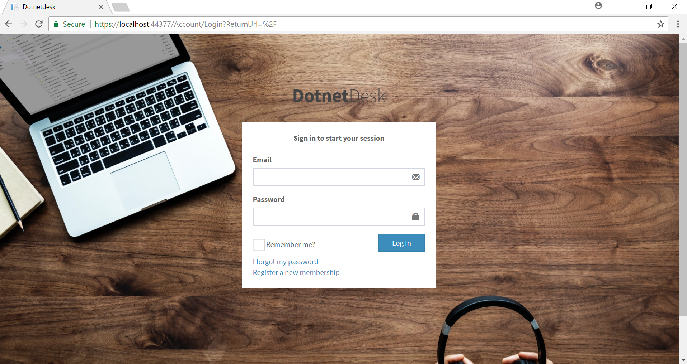
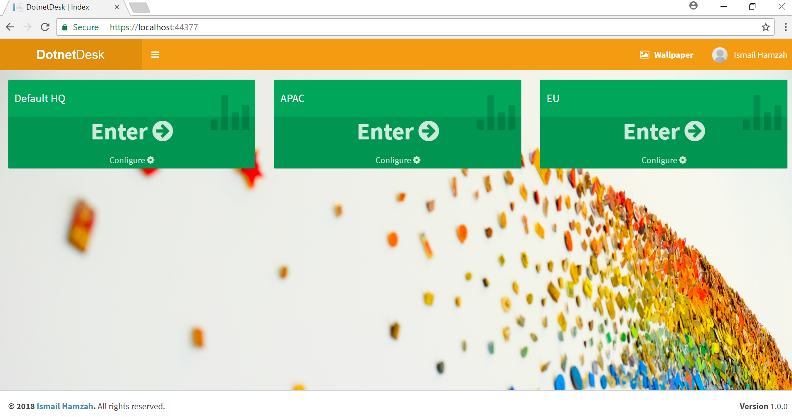
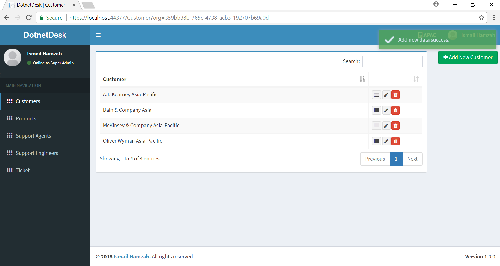
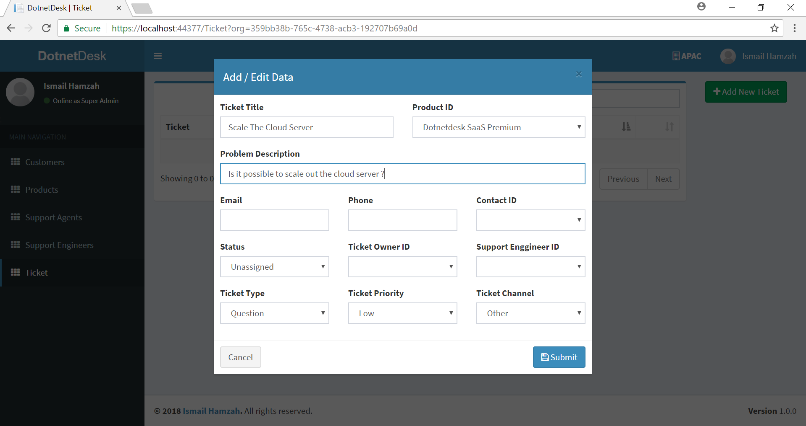
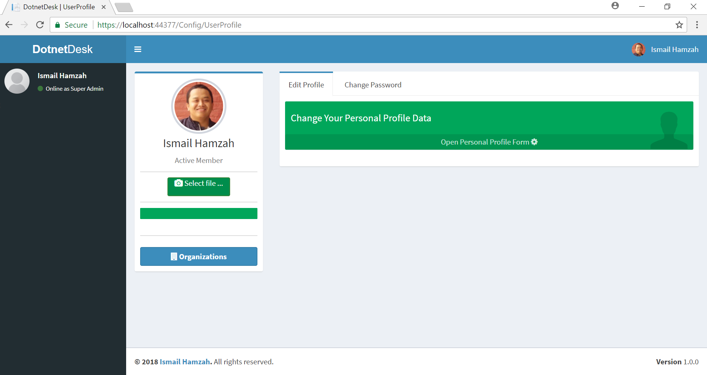

# DotnetDesk
Demonstration web app showing the capabilities of ASP.NET Core 2 MVC, EF (Entity Framework), Web API, Bootstrap, jQuery, datatables, adminlte template and many more. Web app created as helpdesk or ticket support portal.

# Technology
- ASP.NET Core 2 MVC
- EF (Entity Framework) Core Code First
- jQuery
- Ajax
- ASP.NET Core 2 Web API
- Adminlte template
- datatables.net
- Dependency Injection
- Email Handling (SendGrid and SMTP)
- Custom 404/500 error handling
- file upload (using blueimp jquery file upload)

# Business Process
- Ticket
- Comment
- Attachment
- Task
- Feed
- Knowledge Base
- Customer
- Contact
- Product
- Agent
- Engineer

# Planned Features

- organization
	- ticket
		- comments
			- attachments
		- tasks
			- attachments
		- attachments
	- feeds
		- comments
		- attachments
	- knowledge base
		- attachments
		- comments
	- customers
		- attachments
		- contacts
			- attachments
	- products
	- support agents
	- support engineers

config
-	task priority [high, highest, low, lowest, normal]
-	task status [not started, deferred, in progress, completed]
-	task category [call, meeting, demo, visit]
-	ticket status [open, on hold, escalated, closed]
-	ticket priority [high, medium, low]
-	ticket channel [phone, twitter, email, facebook, web, chat, forum]
-	product category [monitor, phone, desktop, laptop, printer, other hardware, windows, word, excel, powerpoint, other software]

# Screenshots

# Supported by CodeRush.Co
[CodeRush.CO] source code collections (https://coderush.co). 50% Off All Products, Use Discount Code **GITHUB50**
	
	
	
